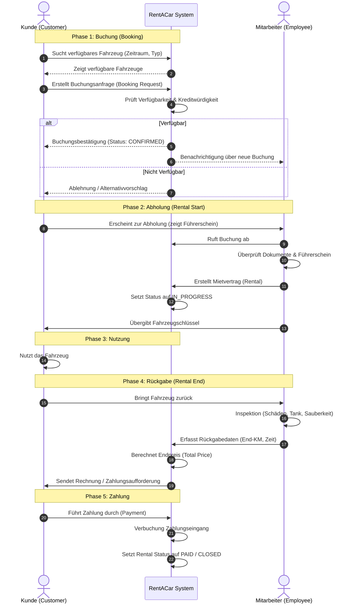
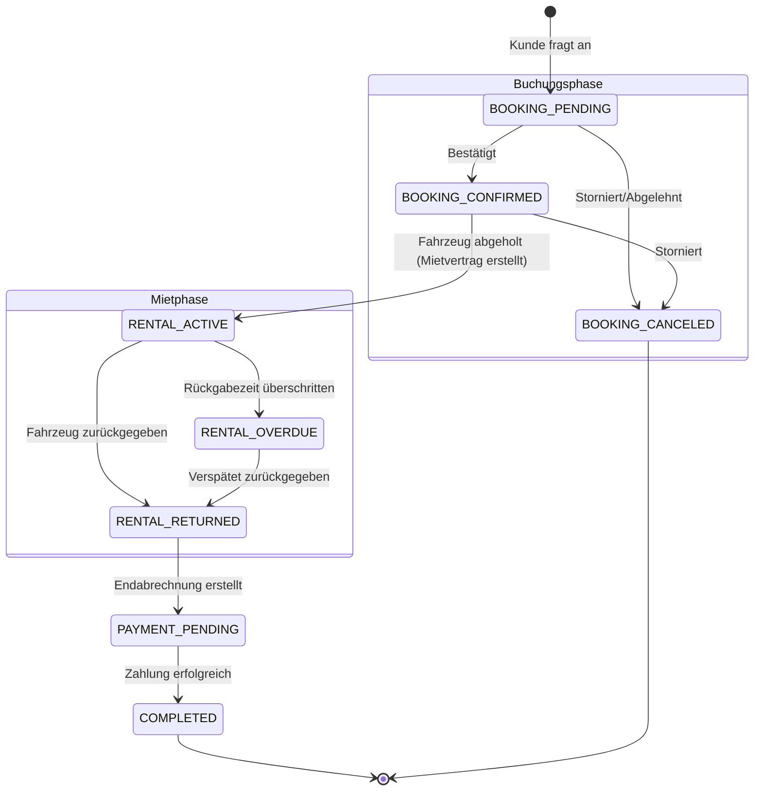

# Geschäftsprozesse für RentACar

Dieses Dokument beschreibt die zentralen Geschäftsprozesse des RentACar-Systems. Der Fokus liegt auf dem Kernprozess der Fahrzeugvermietung, von der Buchung bis zur Rückgabe und Abrechnung.

---

## Kernprozess: Fahrzeuganmietung (End-to-End)

Dieser Prozess beschreibt den Ablauf einer typischen Fahrzeugmiete. Er involviert den Kunden (**Customer**), den Mitarbeiter (**Employee**) und das System (**RentACar System**).

### Ablaufbeschreibung

1.  **Buchungsanfrage**: Der Kunde sucht ein Fahrzeug und fragt eine Buchung für einen bestimmten Zeitraum an.
2.  **Verfügbarkeitsprüfung**: Das System prüft, ob das Fahrzeug verfügbar ist.
3.  **Reservierung**: Bei Verfügbarkeit wird eine Buchung mit Status `PENDING` oder `CONFIRMED` erstellt.
4.  **Fahrzeugabholung (Check-out)**:
    *   Der Kunde erscheint zur Abholung.
    *   Der Mitarbeiter prüft Führerschein und Identität.
    *   Ein Mietvertrag (**Rental**) wird erstellt (Start-Kilometerstand, Zeit).
    *   Fahrzeugübergabe an den Kunden.
5.  **Nutzungsphase**: Der Kunde nutzt das Fahrzeug.
6.  **Fahrzeugrückgabe (Check-in)**:
    *   Der Kunde bringt das Fahrzeug zurück.
    *   Der Mitarbeiter prüft auf Schäden und erfasst den End-Kilometerstand.
    *   Der Mietvorgang wird abgeschlossen.
7.  **Abrechnung**: Das System berechnet den Endpreis (basierend auf Zeit, Kilometern, Schäden).
8.  **Zahlung**: Der Kunde tätigt die Zahlung, und der Vorgang wird geschlossen.

---

## Mermaid-Diagramm: Sequenzdiagramm

Dieses Diagramm visualisiert die Interaktionen zwischen den Beteiligten über die Zeit.

---

## Mermaid-Diagramm: Zustandsdiagramm (State Diagram)

Dieses Diagramm zeigt die Zustände, die eine Buchung bzw. ein Mietvorgang durchlaufen kann.

