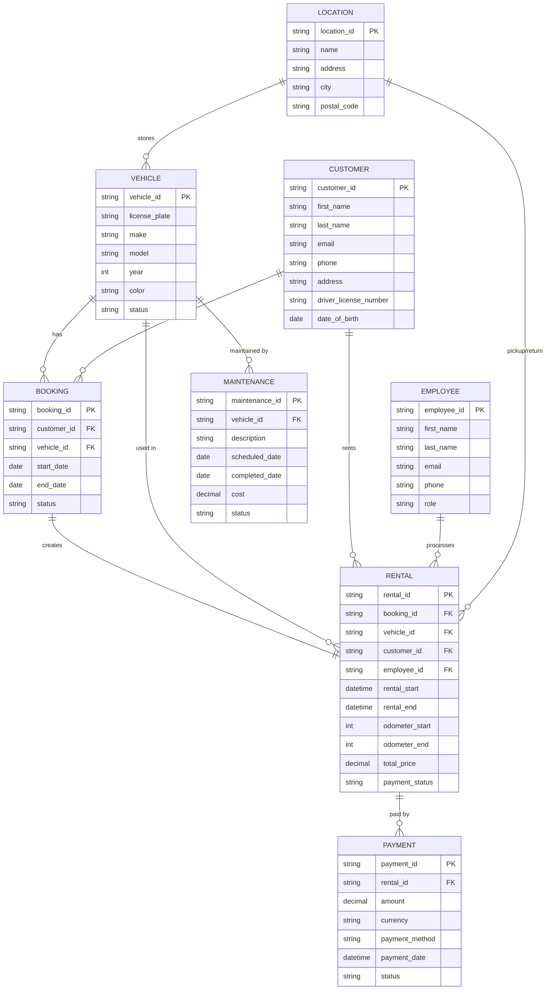

# ER‑Modell für das RentACar‑Projekt

Dieses Dokument beschreibt das vollständige Entity‑Relationship‑Modell (ER‑Modell) des RentACar‑Backends. Es enthält die wichtigsten Entitäten, Attribute, Beziehungen und ein Mermaid‑Diagramm, das in Markdown‑Editoren visualisiert werden kann.

---

## Überblick über die Entitäten

| Entität      | Kurzbeschreibung                               | Wichtige Attribute |
|--------------|-----------------------------------------------|--------------------|
| **Vehicle**  | Fahrzeug‑Stammdaten                           | `vehicle_id` (PK), `license_plate`, `make`, `model`, `year`, `color`, `status` (AVAILABLE, RENTED, MAINTENANCE) |
| **Customer** | Kunden‑Stammdaten                             | `customer_id` (PK), `first_name`, `last_name`, `email`, `phone`, `address`, `driver_license_number`, `date_of_birth` |
| **Employee** | Mitarbeitende (z. B. Service‑Personal)         | `employee_id` (PK), `first_name`, `last_name`, `email`, `phone`, `role` (ADMIN, STAFF) |
| **Booking**  | Reservierung eines Fahrzeugs                  | `booking_id` (PK), `customer_id` (FK), `vehicle_id` (FK), `start_date`, `end_date`, `status` (PENDING, CONFIRMED, CANCELED) |
| **Rental**   | Tatsächlicher Mietvorgang (nach Bestätigung) | `rental_id` (PK), `booking_id` (FK), `vehicle_id` (FK), `customer_id` (FK), `employee_id` (FK), `rental_start`, `rental_end`, `odometer_start`, `odometer_end`, `total_price`, `payment_status` (PAID, PENDING) |
| **Payment**  | Zahlungsinformationen                         | `payment_id` (PK), `rental_id` (FK), `amount`, `currency`, `payment_method` (CREDIT_CARD, PAYPAL, BANK_TRANSFER), `payment_date`, `status` |
| **Maintenance** | Wartungs‑ und Reparaturaufträge            | `maintenance_id` (PK), `vehicle_id` (FK), `description`, `scheduled_date`, `completed_date`, `cost`, `status` (SCHEDULED, IN_PROGRESS, DONE) |
| **Location** (optional) | Stationen/Standorte für Abholung/Rückgabe | `location_id` (PK), `name`, `address`, `city`, `postal_code` |

---

## Beziehungen (Cardinalitäten)

| Beziehung                | Beschreibung                                          | Kardinalität |
|--------------------------|------------------------------------------------------|--------------|
| Vehicle – Booking        | Ein Fahrzeug kann **mehrere** Buchungen haben; jede Buchung bezieht sich auf **ein** Fahrzeug. | `Vehicle 1 ──< Booking *` |
| Customer – Booking       | Ein Kunde kann **mehrere** Buchungen tätigen; jede Buchung gehört zu **einem** Kunden. | `Customer 1 ──< Booking *` |
| Booking – Rental          | Jede bestätigte Buchung wird zu **einem** Mietvorgang; ein Mietvorgang hat **genau eine** zugehörige Buchung. | `Booking 1 ──1 Rental` |
| Vehicle – Rental          | Ein Fahrzeug kann **mehrere** Mietvorgänge über die Zeit haben; jeder Mietvorgang bezieht sich auf **ein** Fahrzeug. | `Vehicle 1 ──< Rental *` |
| Customer – Rental         | Ein Kunde kann **mehrere** Mietvorgänge haben; jeder Mietvorgang gehört zu **einem** Kunden. | `Customer 1 ──< Rental *` |
| Employee – Rental         | Ein Mitarbeitender kann **mehrere** Mietvorgänge abwickeln; jeder Mietvorgang wird von **einem** Mitarbeitenden bearbeitet. | `Employee 1 ──< Rental *` |
| Rental – Payment          | Ein Mietvorgang kann **mehrere** Zahlungen haben; jede Zahlung gehört zu **einem** Mietvorgang. | `Rental 1 ──< Payment *` |
| Vehicle – Maintenance     | Ein Fahrzeug kann **mehrere** Wartungsaufträge erhalten; jeder Wartungsauftrag bezieht sich auf **ein** Fahrzeug. | `Vehicle 1 ──< Maintenance *` |
| Location – Vehicle (optional) | Ein Standort kann **mehrere** Fahrzeuge besitzen; ein Fahrzeug ist an **einem** Standort stationiert. | `Location 1 ──< Vehicle *` |
| Location – Rental (optional) | Ein Mietvorgang hat **einen** Abhol‑ und **einen** Rückgabe‑Standort. | `Location 1 ──< Rental *` (zweimal) |

---

## Mermaid‑Diagramm

---

*Dieses Dokument kann als Grundlage für die Implementierung der JPA‑Entitäten, Repository‑Interfaces und Service‑Klassen im RentACar‑Projekt verwendet werden.*
